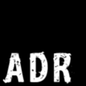
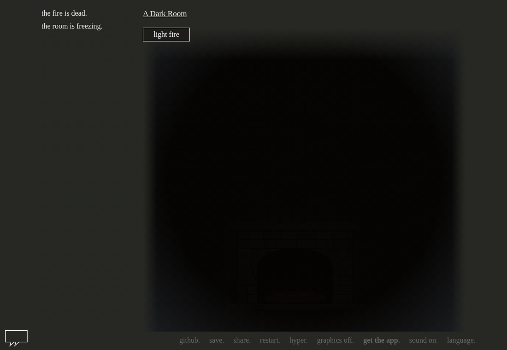
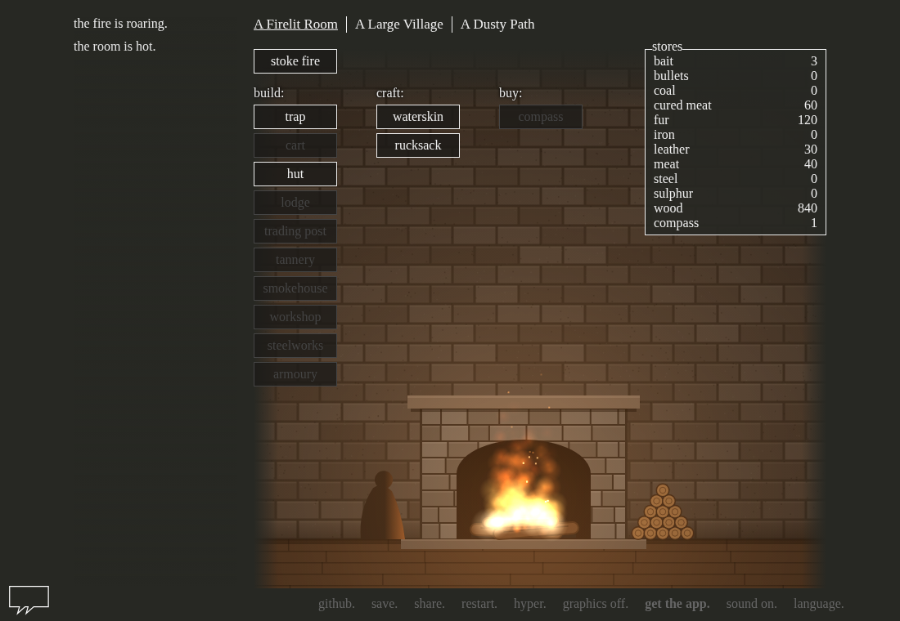
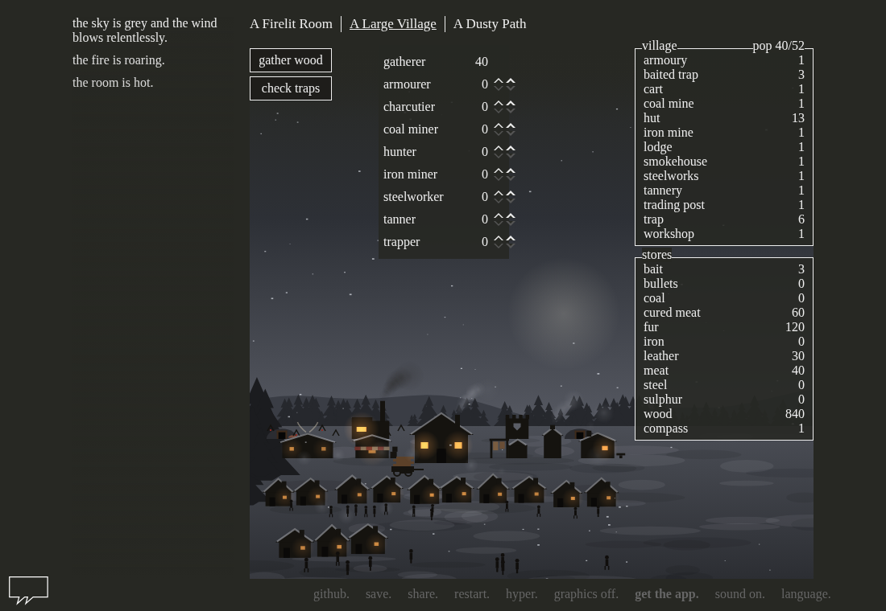
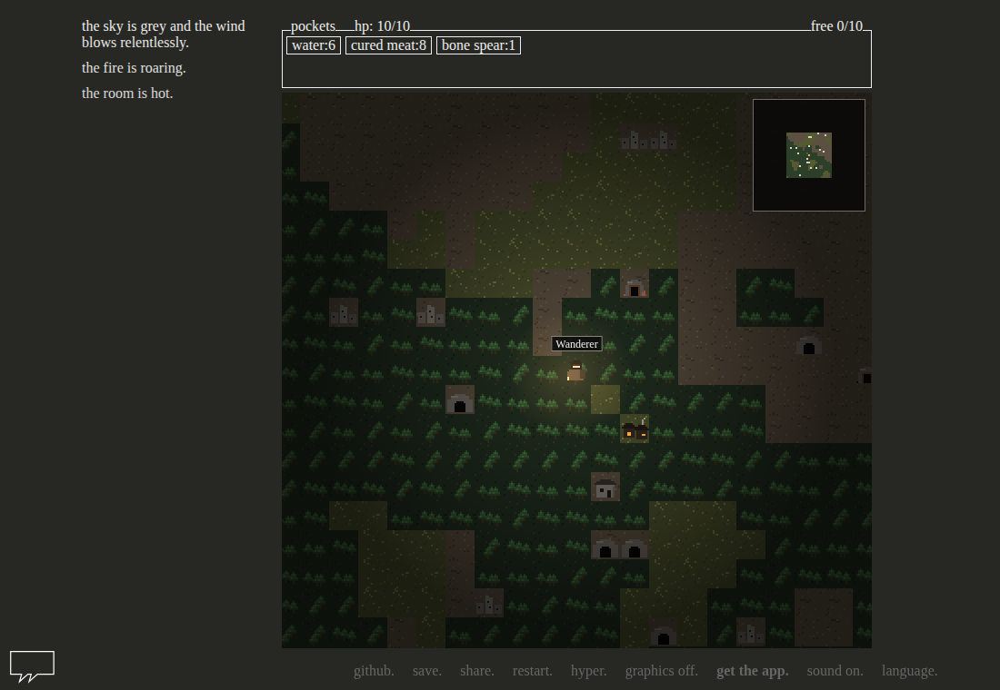
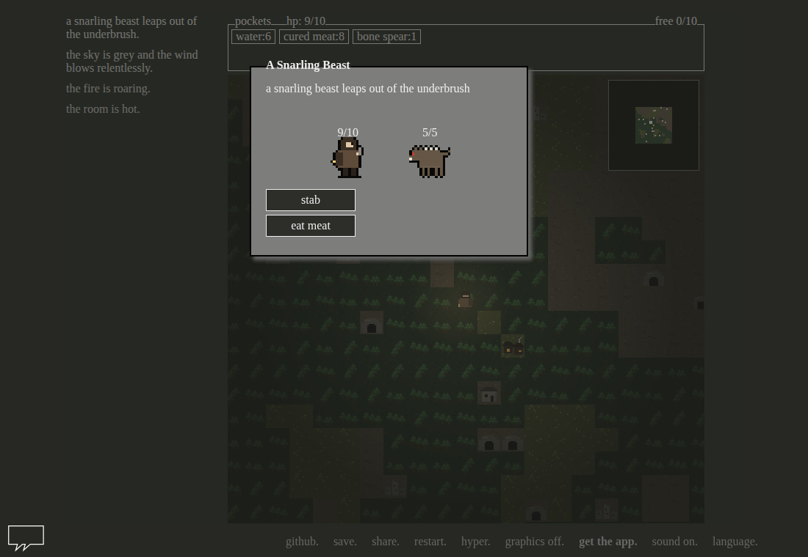
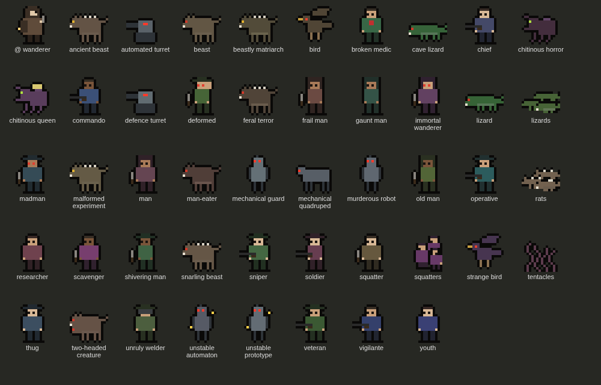

<p align="center">
  
</p>

# A Dark Room (Graphics) on StartOS

> Everything not listed in this document should behave the same as upstream
> A Dark Room. If a feature, setting, or behavior is not mentioned here, the
> upstream documentation is accurate and fully applicable — see the
> Documentation section of `instructions.md` for links.

[A Dark Room](https://github.com/doublespeakgames/adarkroom) is doublespeak games' minimalist browser adventure: a cold, dark room that grows into a village and an expedition across a ruined world. This package serves the original game with a graphics layer added on top: a room lit by its fire, a village drawn as it grows, a pixel-art world map and illustrated fights. The layer draws the game without changing how it plays, and "graphics off." in the game's menu returns to the original text game.

| | |
|---|---|
|  |  |
|  |  |
|  |  |

- **Upstream repo:** <https://github.com/doublespeakgames/adarkroom> (the `adarkroom` submodule)
- **Wrapper repo:** <https://github.com/DigiMonk73/adarkroom-startos> (the package and the graphics layer)
- **Downloads:** the s9pk for each version is on the [Releases](https://github.com/DigiMonk73/adarkroom-startos/releases) page (sideload in StartOS)

---

## Table of Contents

- [Image and Container Runtime](#image-and-container-runtime)
- [Volume and Data Layout](#volume-and-data-layout)
- [File Models](#file-models)
- [Dependencies](#dependencies)
- [Network Access and Interfaces](#network-access-and-interfaces)
- [Installation and First-Run Flow](#installation-and-first-run-flow)
- [Actions](#actions)
- [Tasks](#tasks)
- [Health Checks](#health-checks)
- [Backups and Restore](#backups-and-restore)
- [Limitations and Differences](#limitations-and-differences)
- [Quick Reference for AI Consumers](#quick-reference-for-ai-consumers)

---

## Image and Container Runtime

Upstream publishes no image, so this package builds its own from the repository's `Dockerfile`: the game from the `adarkroom` submodule (pinned to an upstream commit) and the graphics layer from `graphics/`, assembled into static files and served by nginx.

| Property      | Value                                                                              |
| ------------- | ---------------------------------------------------------------------------------- |
| Image         | Built from `Dockerfile`: the official `nginx` Alpine image plus the assembled site  |
| Architectures | x86_64, aarch64                                                                    |
| Command       | `nginx -g 'daemon off;'` (the image's entrypoint scripts are not run)              |
| Site          | `/usr/share/nginx/html`; nginx config from `nginx.conf`                            |

| Subcontainer | Purpose                                     |
| ------------ | ------------------------------------------- |
| `nginx`      | The `webui` daemon — the one to attach to   |

The served site differs from upstream's files in three ways, all made at image build time by `scripts/build-game.sh`:

- `index.html` loads the graphics layer (`gfx/gfx.css`, `gfx/js/*.js`).
- `index.html` no longer loads Google Analytics or jQuery from Google's CDN; the game falls back to its bundled copy of jQuery, so a page load makes no outside request.
- Upstream's development files (its Node dev server, docs, tools) and translation sources (`.po`, `.pot`) are left out; the compiled translations the game loads are kept.

nginx logs no requests (`access_log off`); errors go to the service log.

## Volume and Data Layout

None. The package declares no volumes: the game is static files in the image, and nothing is written on the server.

Game progress is saved by the game itself in the **browser's** local storage, as upstream does. Local storage belongs to one browser and one address, so the LAN address, the Tor address and a custom domain each hold a separate save. The graphics on/off choice is stored the same way.

## File Models

None. There is no configuration file and nothing for the package to write.

## Dependencies

None.

## Network Access and Interfaces

One interface, serving the game.

| Interface | Id   | Type | Port | Description                       |
| --------- | ---- | ---- | ---- | --------------------------------- |
| Web UI    | `ui` | ui   | 80   | Play A Dark Room in your browser  |

The port is bound on the `ui-multi` MultiHost and is not masked. There is no login: anyone who can reach an address can play, each in their own browser save. The service makes no outbound connections.

## Installation and First-Run Flow

Nothing to configure. Install, start, open the Web UI, and the game begins (graphics on). There is no task, no account and no credential.

## Actions

None.

## Tasks

None.

## Health Checks

One check, on the only daemon.

| Check   | Displayed       | Method                               |
| ------- | --------------- | ------------------------------------ |
| `webui` | "Web Interface" | `GET /` on port 80 must return 200   |

"The game is not responding" means nginx is not answering (see the service log); "The game page returned HTTP …" means it answers but cannot serve the page, which points at a broken image.

## Backups and Restore

The backup is empty: with no volumes, `sdk.Backups.ofVolumes()` has nothing to copy. **A StartOS backup does not include game progress**, which lives in players' browsers. A player keeps a copy with the game's own **save.** menu (export / import), which is also how a save moves to another browser or address.

## Limitations and Differences

1. **Saves are per browser and per address**, never on the server (see Volume and Data Layout). Clearing site data in the browser deletes the save.
2. **The graphics layer** draws four places: the room (a hearth whose fire follows the fire level and is the room's only light), the village (every building type, smoke, villagers scaled to population), the world map (tiles, a camera that follows the player, fog of war, a minimap, landmark names on hover, click-to-move) and fights (a sprite per enemy type, hit and death effects). Everything else, including the ship and the space ending, looks as upstream. The layer reads the game's state and never changes its rules.
3. **Graphics use the dark theme.** While graphics are on, the page stays dark and upstream's "lights off." toggle is hidden; "graphics off." restores the player's previous lights setting.
4. **Phones and tablets** are sent to upstream's page about the mobile apps, as upstream does; the web game needs a computer.
5. **The game's own links still leave the server when clicked:** "github.", "share." and "get the app." open upstream's GitHub, social sites and app stores. Nothing is requested unless a player clicks one.

---

## Quick Reference for AI Consumers

```yaml
package_id: adarkroom-graphics
image: built from Dockerfile (nginx alpine + adarkroom submodule + graphics/)
architectures:
  - x86_64
  - aarch64
subcontainers:
  - nginx # the webui daemon
volumes: {} # none; saves are in each browser's local storage
file_models: []
startos_managed_env_vars: []
dependencies: none
interfaces:
  ui: { type: ui, port: 80 }
actions: []
tasks: []
health_checks:
  - webui # displayed "Web Interface"
```
